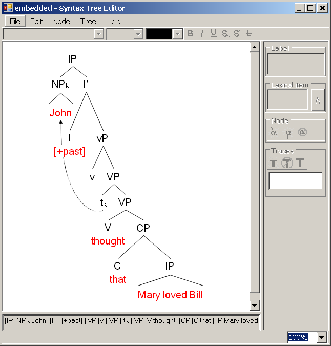
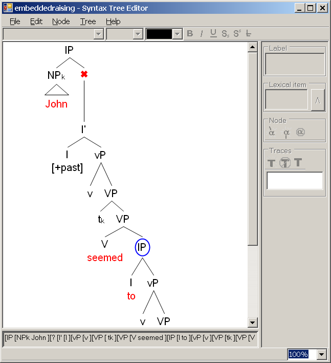
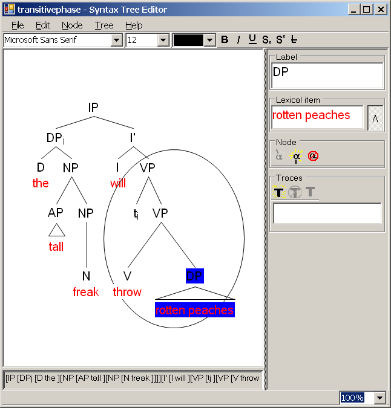
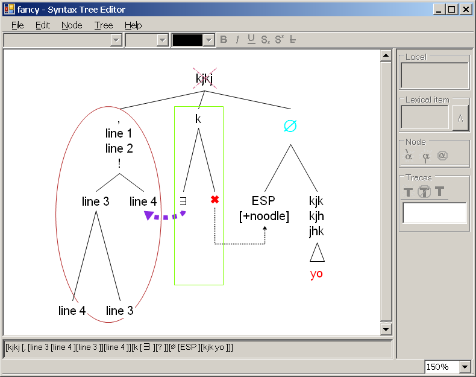

Syntax Tree Editor
------------------

This is a simple drawing tool for linguists and those interested in linguistics. Using a graphical interface, you can draw syntax trees: visual representations of the hierarchical structure of sentences. These trees can then be exported to PNG or SVG format, suitable for inclusion in presentations or papers.

This is a drawing tool only. It does not provide any ability to automatically analyze sentences or verify the correctness of your tree.

It should run under any reasonably modern version of Windows, including XP, Vista, 7, and 8, 10, and 11.

This program requires the [Microsoft .NET Framework version 3.5](https://www.microsoft.com/en-us/download/details.aspx?id=21).

Screenshots below.

